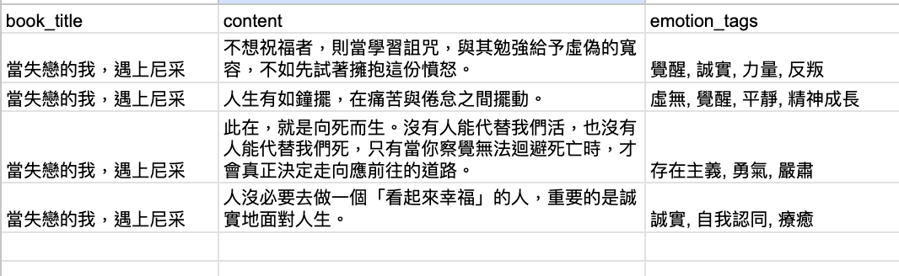

# 腳本說明

本目錄放一次性或維運用腳本。以下說明如何在本機執行，方便重現相同步驟。

---

## 事前準備

### 1. 環境變數 `.env`

在專案根目錄建立或編輯 `.env`

| 變數 | 必填 | 說明 |
|------|------|------|
| `MONGO_URI` | 是 | Atlas 連線字串，格式如 `mongodb+srv://使用者:密碼@cluster...`。 |
| `DB_BOOK_DATA` | 否 | MongoDB **資料庫名稱**。未設定時腳本預設為 `okapi`。 |

### 2. MongoDB Atlas（團隊共用叢集時）

- **Network Access**：將你目前對外 IP 加入允許清單（或依團隊規範設定）。
- **Database Access**：使用「資料庫使用者」帳密，不是登入 Atlas 網站的 Email。

連線是否正常，可在專案根目錄執行（需已啟用 venv 並安裝依賴）：

```bash
python <<'PY'
import os
from pathlib import Path

from dotenv import load_dotenv
from pymongo import MongoClient

load_dotenv(Path(".env"))
uri = os.environ["MONGO_URI"]
client = MongoClient(uri, serverSelectionTimeoutMS=15000)
client.admin.command("ping")
print("ping OK")
client.close()
PY
```

---

## CSV 共通格式（長表）

試算表下載為 CSV 時，請統一使用 **長表**：

- **第一列**：英文欄位名（header）。
- **第二列起**：一列一筆資料（一本書、一則金句、一個角色各一列）。
- 編碼建議 **UTF-8**；欄位內若有逗號，試算表匯出時會自動加引號。

排版可參考同目錄截圖（每種資料類型各一張表時，各自為長表即可）：



---

## `import_books.py`：`data/books.csv` → `books`

| 欄位 | 說明 |
|------|------|
| `title` | 書名 |
| `author` | 作者 |
| `purchase_url` | 購書連結 |
| `category` | 分類 |
| `summary` | 簡介 |
| `sample_link` | 試閱連結 |
| `tags` | 英文逗號 `,` 分隔，匯入為陣列 |

- **增量**：有 **`purchase_url`**（非空白）時以網址 upsert；否則以 **`title` + `author`** upsert。
- **不會**清空整個 `books` 集合。

---

## `import_quotes.py`：`data/quotes.csv` → `quotes`

| 欄位 | 必填 | 說明 |
|------|------|------|
| `book_title` | 是 | 須與 `books` 裡的 `title` **完全一致** |
| `content` | 是 | 金句本文（空白列會略過） |
| `emotion_tags` | 否 | 英文逗號分隔，匯入為陣列 |

- **增量**：以 **`book_ref`（書籍 `_id`）+ `content`** upsert；CSV 沒寫到的金句**不會被刪除**。
- 請先匯入書籍，再匯入金句（需能查到對應書名）。

---

## `import_characters.py`：`data/characters.csv` → `characters`

| 欄位 | 必填 | 說明 |
|------|------|------|
| `book_title` | 是 | 須與 `books` 的 `title` 一致 |
| `name` | 是 | 角色名稱 |
| `description` | 是 | 描述 |
| `mbti` | 否 | 會寫入 `personality_tags`（單一標籤陣列） |
| `image_url` | 否 | 圖片網址 |

- **增量**：以 **`book_id` + `name`** upsert。
- 請先匯入書籍。

---

## 執行方式

**在專案根目錄**執行（腳本使用 `data/*.csv` 相對路徑）：

```bash
cd /path/to/okapi
source .venv/bin/activate
pip install -r requirements.txt   # 首次

python scripts/import_books.py
python scripts/import_quotes.py
python scripts/import_characters.py
```

建議順序：**書籍 → 金句／角色**（後兩者依 `book_title` 關聯 `books`）。

### 成功時輸出

各腳本結尾會印出增量統計（新增／更新／比對筆數），或「無資料可匯入」等提示。

### 常見問題

| 狀況 | 處理方式 |
|------|----------|
| 找不到 `MONGO_URI` | 確認專案根有 `.env`。 |
| 金句／角色找不到書 | 先跑 `import_books.py`，並核對 `book_title` 與資料庫 `title` 一致。 |
| 找不到 `data/*.csv` | 勿先 `cd scripts`，請在專案根執行。 |
